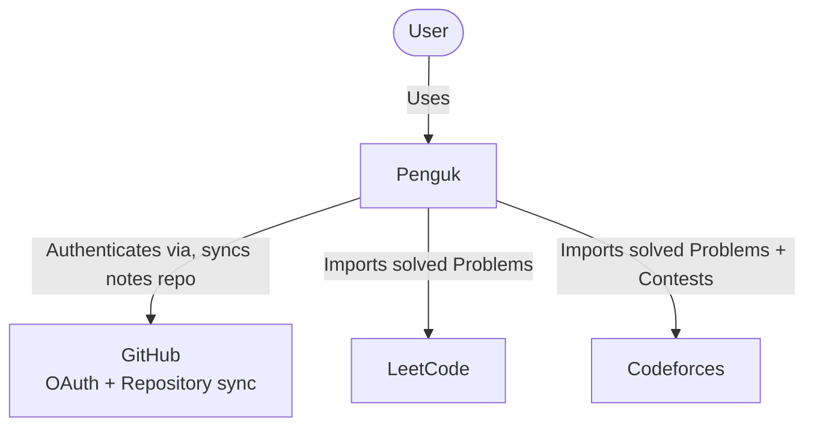

# C4 — System Context

## Notes

- GitHub serves two distinct purposes: **OAuth** (authentication, synchronous)
  and **Repository sync** (Notes storage, background). They are shown as one
  relationship here for simplicity, but are handled by different modules
  (Auth Module vs Notes Module) — see `component.md`.
- LeetCode and Codeforces are read-only integrations (BR-005): Penguk never
  writes back to them.
