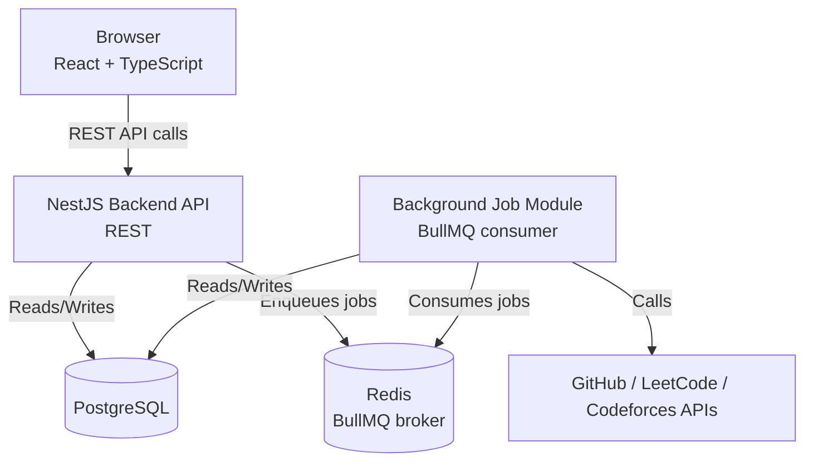

# C4 — Container

## Notes

- `Redis` is the broker BullMQ uses to store queues — it is not a separate
  processing container by itself.
- `Background Job Module` runs **inside the same deployable process** as the
  NestJS API for the MVP (per the Modular Monolith decision in
  `overview.md`), but is isolated as its own module with no other module
  depending on it directly. This means it can be extracted into a separate
  worker process later as a deployment change, not a code rewrite —
  satisfying NFR-007 without paying the operational cost of a separate
  process prematurely.