# C4 — Component (Backend)

```mermaid
graph TD
    Auth[Auth Module]
    Users[Users Module]
    Problems[Problems Module]
    Reviews[Reviews Module]
    Notes[Notes Module]
    Integrations[Integrations Module]
    Dashboard[Dashboard Module]
    Statistics[Statistics Module]
    Contests[Contests Module]
    Jobs[Background Job Module]
```

## Modules

- **Auth Module** — GitHub OAuth + email/password authentication, session/JWT issuance.
- **Users Module** — User profile, preferences, Account, Repository (BR-009, BR-010).
- **Problems Module** — Problem catalog, deduplication by platform + externalId (BR-004).
- **Reviews Module** — Problem Review, spaced repetition scheduling, Review Queue.
- **Notes Module** — Note management, reads/writes to the connected Repository.
- **Integrations Module** — External platform connections and sync status.
- **Contests Module** — Contest data, Contest Participation, Upsolve derivation (BR-007).
- **Dashboard Module** — Aggregated real-time overview (streak, pending reviews, recent activity).
- **Statistics Module** — Heavier analytical breakdowns (by platform, tag, difficulty) — separated
  from Dashboard because it has a different rate of change and performance profile,
  and may need its own caching/materialized views as data grows.
- **Background Job Module** — BullMQ job consumer, calls external platform APIs.
  Isolated so it can be extracted into its own process later without
  refactoring other modules (see `c4-container.md`).

No module queries another module's database tables directly — all
cross-module communication happens through each module's exposed service
interface.