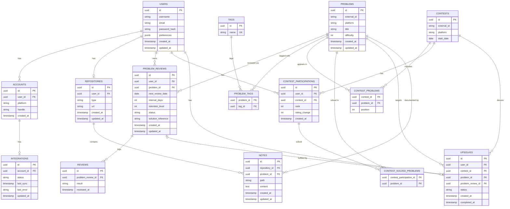

# Database — Entity Relationship Diagram

## Design notes

- `PROBLEM_TAGS` and `CONTEST_SOLVED_PROBLEMS` are junction tables rather
  than array/JSON columns — see `normalization.md` for the rationale.
- `ACCOUNTS.platform` + `INTEGRATIONS` enforce BR-009 (at most one account
  per platform) at the application layer; the uniqueness itself is
  enforced by a composite unique constraint (`user_id`, `platform`) —
  see `indexing.md`.
- `PROBLEMS` is a global catalog shared across all users (not owned by a
  single User), matching the Domain Model's separation between `Problem`
  and `Problem Review`.
- Only `PK` and `FK` are shown as key markers in the diagram, for
  compatibility with Mermaid renderers that don't support the `UK`
  modifier or inline attribute comments. Uniqueness constraints and
  nullable columns are documented in `indexing.md` and
  `naming-conventions.md` instead of in the diagram itself.

## Nullable columns (not shown as comments above, for rendering compatibility)

- `users.password_hash` — nullable; a User authenticated only via GitHub
  OAuth has no password (ADR-0008).
- `integrations.last_error` — nullable; only populated when the last sync failed.
- `problem_reviews.solution_reference` — nullable; may not be set immediately.
- `upsolves.problem_review_id` — nullable until the user starts working on it.
- `upsolves.completed_at` — nullable until the Upsolve is completed.
- `notes.problem_id` — nullable; a Note may exist without being linked to a Problem.

## Unique constraints (not shown as `UK` above, for rendering compatibility)

- `users.email` — unique.
- `repositories.user_id` — unique (BR-010: at most one Repository per User).
- See `indexing.md` for the full list of unique constraints, including
  composite ones (e.g. `accounts(user_id, platform)`).
